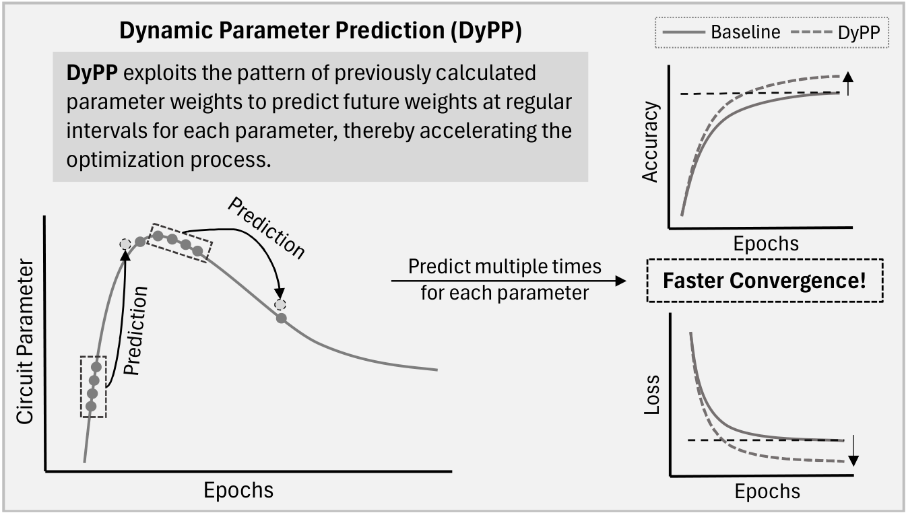

<h1 align="center" style="margin-top: 0px;"> <b>DyPP: Dynamic Parameter Prediction to Accelerate Convergence of Variational Quantum Algorithms</b></h1>
<div align="center" >

[](https://arxiv.org/abs/2307.12449)
</div>

<p align="center">

</p>

## **Description**

This repository contains the implementation of <ins>DyPP</ins> and its application to accelerate <ins>QNNs</ins> convergence on MNIST classification problem as in:

- Paper : **DyPP: Dynamic Parameter Prediction to Accelerate Convergence of Variational Quantum Algorithms**
- Authors : **Satwik Kundu, Debarshi Kundu and Swaroop Ghosh**

## **Setup**

To <ins>install</ins>, execute the following commands:

```
$ git clone https://github.com/satwik-kundu/dynamic-parameter-prediction.git
$ cd dynamic-parameter-prediction
$ pip install -r requirements.txt
```

## **Dataset Generation**
In this work, we used a convolutional autoencoder (modified) to reduce feature dimension from original $28*28$ to tunable dimension $d$ specified in `autoencoder.py`. To generate reduced MNIST feature set of dimension 32, run:
```
$ python autoencoder.py --dimension 32
``` 
For d = 32, running the above command would generate the reduced dataset stored in a csv file named `latent_mnist_test_d32.csv`.

## Build QNN, Prediction and Training

The QNN circuit builder has been modified from our [previous work](https://arxiv.org/abs/2109.02862) and individual circuit blocks are implemented in `app`. The pytorch implementation for the QNN model is defined in `qnn_torch.py`, where:

| Parameter | Description | Value Range |
|:-:|:-:|:-:|
| `qubit` | Number of qubits | Any |
| `enc` | Features encoded per qubit | $[1, 6]$ |
| `pqc` | Parameterized quantum circuit architectures | $[1, 19]$ |
| `layers` | Number of pqc layers | Any |
| `meas` | Measurement operations | $[1, 5]$ |

The hyperparameters for our parameter prediction technique are also defined in `qnn_torch.py`, where:

| Parameter | Description | Value Range |
|:-:|:-:|:-:|
| `p` | Prediction interval | $[4, -]$ |
| `d` | Prediction distance | $[4, 8]$ |
| `k` | Proportionality constant | 0.0001 (constant) |
| `dr` | Decay rate | 0.95 (constant) |

After setting the hyperparameters, to train a QNN model on dataset `latent_mnist_test_d32.csv`, choose encoding and qubit count accordingly and run:

```
python qnn_torch.py latent_mnist_test_d32.csv
```